# 가계쀼

## 😎 개요

- 팀명: **쀼의세계**
- 서비스명: **가계쀼**
- 개발기간: **2024년 8월 16일 ~ 8월 31일**

 

## 👨‍👩‍👧‍👦 팀원

- 서지흔 (팀장, Frontend, Backend)
- 박정의 (Frontend, Backend, AI)
- 유병주 (Frontend, Backend)
- 윤정섭 (AI, Backend)
- 임동길 (Frontend, Backend, Infra)

 

## ⚙ 사용 기술

**FE**

**BE**

**AI**

**DevOps**

**협업**

 
 

## 개발환경

| 분야     | 기술 스택      | 버전      |
| -------- | -------------- | --------- |
| Backend  | Java           | 17        |
|          | Spring Boot    | 3.3.2     |
|          | JPA            | 5.0.0     |
| Database | MySQL          | 8.0       |
| AI       | PyTorch        | 2.4.0     |
|          | TensorFlow     | 2.17.0    |
|          | FastAPI        | 0.112.2   |
|          | Python         | 3.9, 3.12 |
| Frontend | Flutter        | 3.24.1    |
|          | Dart           | 3.5.1     |
| DevOps   | Docker         | 27.1.2    |
|          | Docker Compose | 2.1.0     |

## 빌드 및 배포 환경

| 도구    | 버전   |
| ------- | ------ |
| Gradle  | 7.3    |
| Uvicorn | 0.30.6 |

## 실행 방법

| 도구        | 방법        |
| ----------- | ----------- |
| Spring boot | AWS, Docker |
| FastAPI     | AWS, Docker |
| MySql       | AWS, Docker |
| Jenkins     | AWS, Docker |
| Flutter     | APK build   |

 
 

## 🤔 기획배경

- 신혼 부부들의 공동 자산 관리 경험 부족
- 경험 부족으로 인해 개인과 공동 재무의 균형 유지 어려움
- 서로 다른 재무 습관 갈등 해소

 

## 🎇 서비스 소개

- 자산 공유를 통해 부부가 함께 재무 목표를 설정하고 달성해 나가는 '공유 펀딩' 시스템
- 공동 및 개인 지출 카테고리화와 AI 기반 지출 패턴 분석 제공
- 실시간 자산 현황 대시보드와 공동 및 개인 지출 내역 간편 조회
- 공동으로 관리할 계좌 및 카드만 선택 공유 가능
- 비슷한 재정 상태(연령대, 연봉)를 가진 타 부부와의 한 달 지출 금액 비교
- 공동 자산을 바탕으로 부부의 소비성향 분석 후 AI를 통한 맞춤형 예·적금 상품 추천
- 부부가 필요한 대출 금액 설정 후, 부부의 상황에 맞춘 비율을 제공하여 최적화된 대출 상품 및 방안 추천

 

## 타 서비스와의 차별점

- 토스뱅크 -> 토스 뱅크는 모임 통장의 카드를 쓴 사람의 이름으로 소득 공제가 되어 결국 부부 통장일지라도 소득이 많은 사람 명의의 카드를 사용해야 한다.
  따로 공동 명의 통장을 개설할 필요 없이 현재 가지고 있는 통장의 등록으로 공유 자산으로 취급할 수 있다.
  마이데이터 API 분석을 통해 더 좋은 조건의 카드나 상품을 추천해줌.

- 뱅크 샐러드 -> 단순 보여주기에 그치지만 ‘가계쀼’는 분석을 통한 맞춤형 상품을 추천해준다.
  부부는 자산 리포트을 통해 자산을 관리할 수 있으며 타 부부와의 소비 패턴 분석을 통해 부부의 소비 습관을 확인할 수 있다.

## 💞 기능 상세

### 1. 메인 페이지

|                                        |                                          |                                        |
| -------------------------------------- | ---------------------------------------- | -------------------------------------- |
| ✨ 회원가입                            | 📌 초기로그인                            | 📌 로그인                              |
|       |          |    |
| ✨ 커플신청                            | 📌 커플연결                              | 📌 자산연결                            |
| 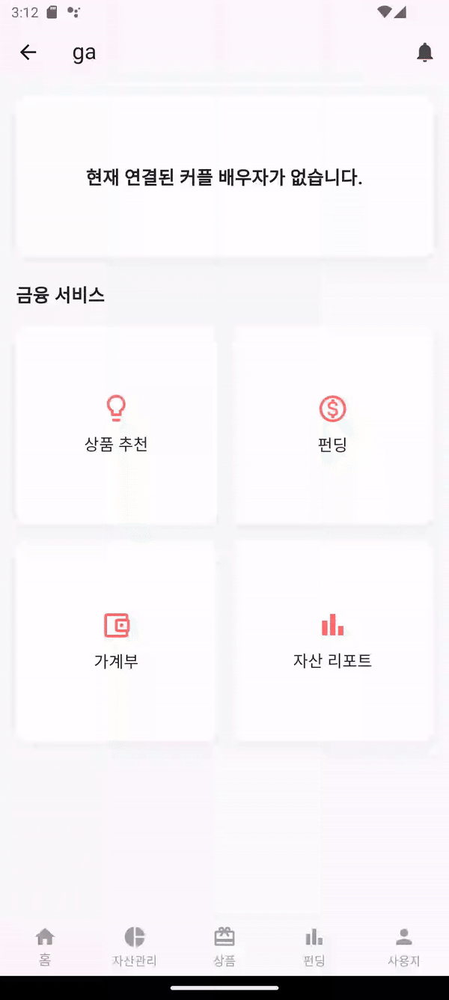     |        | 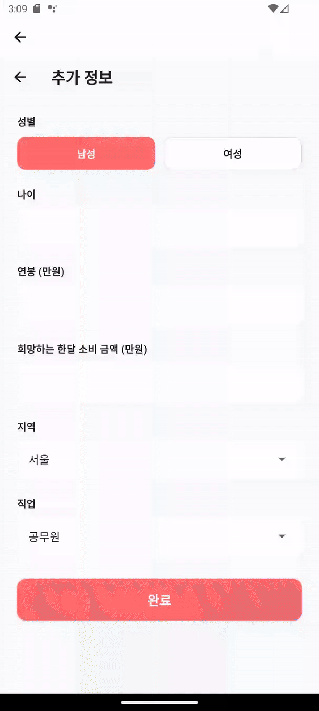     |
| 🔑 펀딩생성                            | 🔍 펀딩입금                              | 🔍 펀딩출금                            |
|      | 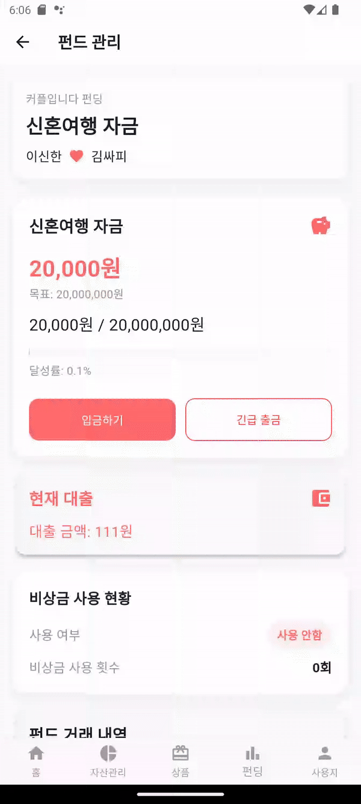       | 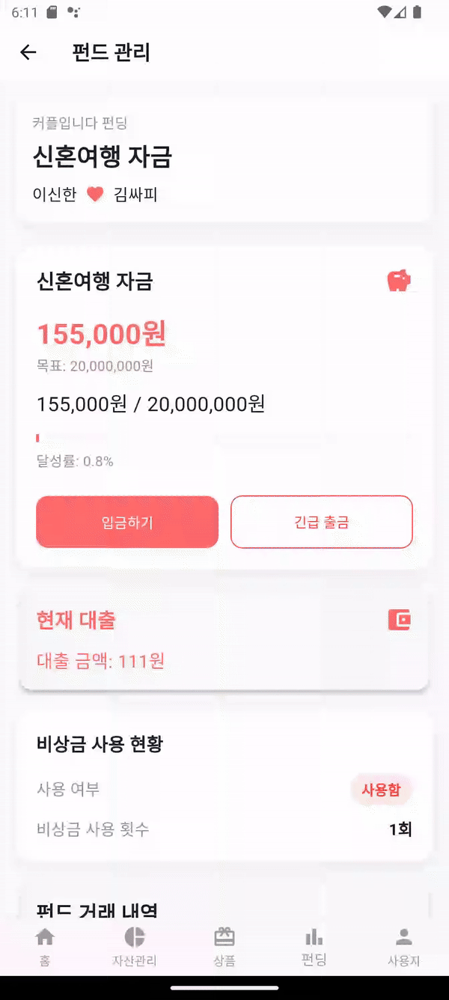     |
| 💚 개인대출추천                        | 👶 개인예적금추천                        | 👶 부부대출추천                        |
|  |  |  |
| 📖 가계부리스트                        | 👱‍♀️ 가계부캘린더                          | 👱‍♀️ 소비통계                            |
| 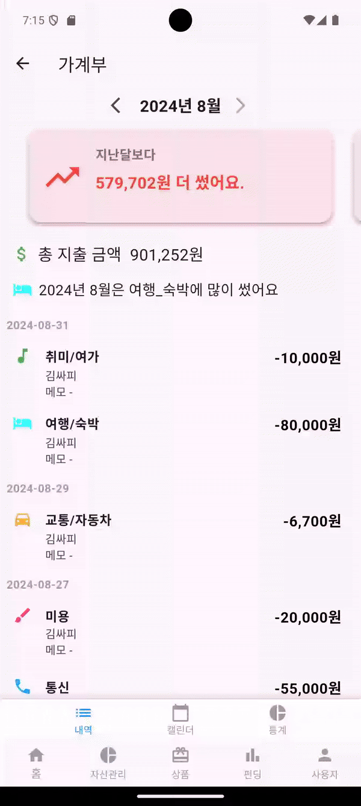 | 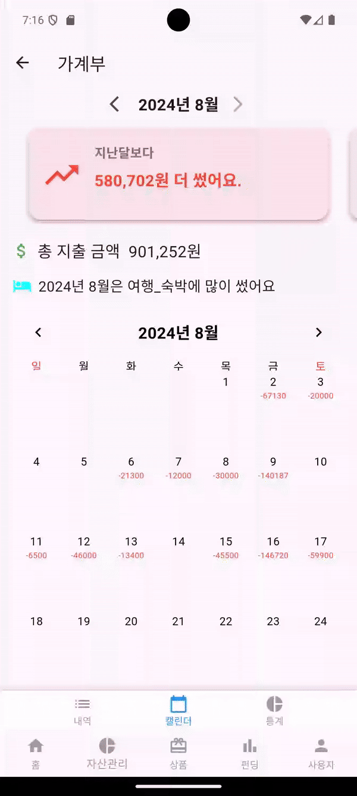   |      |
| 🚪 자산리포트                          | 👂                                       | 👂                                     |
| 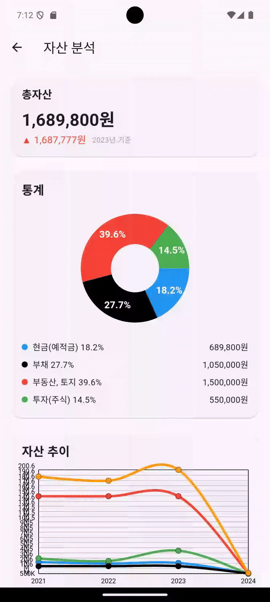   |                |                  |

- 소셜 로그인 (구글, 카카오)
  
- 인기 챌린지 - 마우스 오버시 재생
  
- 키워드 및 유튜브 쇼츠 url로 바로 검색 가능
  
  
- 쇼츠 url 아닐 시 에러 메시지 표시
  

 

### 2. 상세 페이지

- 원본 영상 및 상세 정보 확인
- 즐겨찾기
- 해당 영상을 연습한 유저 랭킹 확인 및 간단한 프로필 정보 확인
  - 유튜브 링크 공유시 확인 가능
    

 

### 3. 검색 페이지

- 키워드 및 쇼츠 url로 검색 가능
- 최근 검색어 자동 저장 및 삭제
- DB에 학습된 영상 강조 표시, 추가로 유튜브 조회수 상위 기준으로 표시
  

 

### 4. 연습 페이지

- 재생 속도, 좌우 반전, 음량 조절, 카메라 변경, 타이머 기능 제공
- 초보자를 위한 가이드 ON / OFF 기능
- 실시간으로 점수 계산하여 화면에 표시
  

 

### 5. 결과 페이지

- 일치율 점수 확인
- 일치율 그래프에서 시간 클릭시 해당 영상 시간으로 이동하여 확인
- 일치율 가장 높은 구간이 썸네일로 저장
- 제목 편집
- 카카오톡, 유튜브 소셜 공유
- 영상 다운로드 및 삭제
  

 

### 6. 프로필 페이지

- 연습한 영상 점수별, 업로드 날짜별로 정렬하여 확인
- 즐겨찾기한 영상 확인
- 프로필 편집
- 로그아웃, 탈퇴
  

 

## 🧱 배포 아키텍쳐

 

## 💾 AI 개인 추천시스템

### 1. 전처리

- 범주형 데이터는 LabelEncoder를 사용해서 수치화 시키기 위해 전처리 진행
- 수치형 데이터는 MinMaxScaler를 사용해서 전처리 진행
   

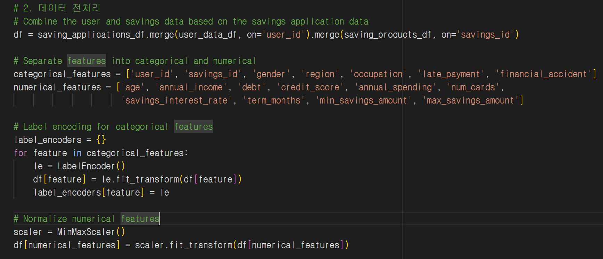

 

### 2. DeepFM 모델 학습

- DeepFM 모델 : CTR(Click Through rate)을 최대화 하는 것을 목적으로 하는 모델 -> 가계쀼 서비스에서는 상품 추천을 선택할 확률을 목적으로 하였음

  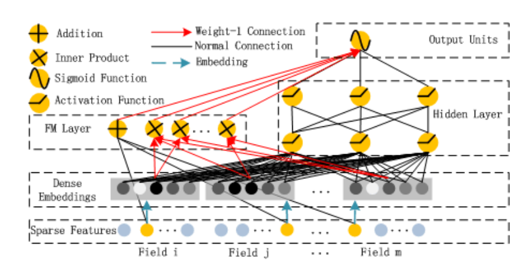

- 구현
  

 

### 3. 추천 결과

- key값은 추천하는 ID, value값은 이 상품을 선택할 확률을 반환
  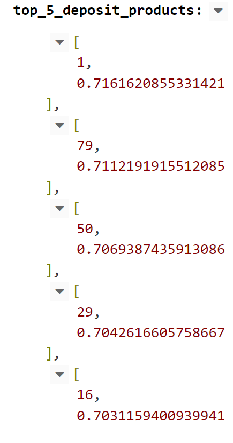

 

## 부부 공동 대출 추천 시스템

- 남자, 여자의 소득, 부채, 총 목표 금액, 신용등급, 주택담보대출 여부를 기반으로 가능한 모든 상품을 체크해서 남자 여자가 어느정도의 비율로 어떤 상품을 대출하면 좋을지 추천을 진행.

- 추천 진행 시 2024년 9월 1일부터 적용되는 스트레스 DSR 반영

  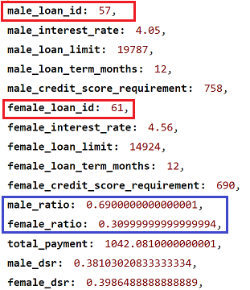

## 📊 ERD 다이어그램

 

## 💬 API 명세서

 

## 🖼️ 와이어프레임

